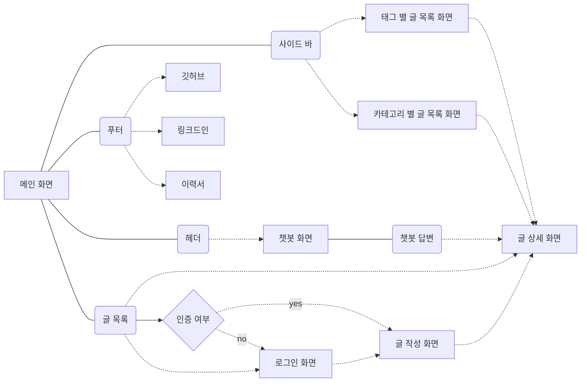

# Next.js 블로그 + 챗봇 프로젝트 플로우 차트

```mermaid
flowchart LR
    Home[메인 화면]
    Sidebar(사이드 바)
    Header(헤더)
    List(글 목록)
    Footer(푸터)

    Home --- Sidebar
    Home --- Header
    Home --- List
    Home --- Footer

    Chatbot[챗봇 화면]
    CjatbotAnswer(챗봇 답변)
    Create[글 작성 화면]
    Login[로그인 화면]
    Detail[글 상세 화면]
    TagResultList[태그 별 글 목록 화면]
    CategoryResultList[카테고리 별 글 목록 화면]
    Git[깃허브]
    LinkedIn[링크드인]
    Resume[이력서]

    Authorize{인증 여부}

    Sidebar -.-> TagResultList -.-> Detail
    Sidebar -.-> CategoryResultList -.-> Detail
    Header -.-> Chatbot --- CjatbotAnswer -.-> Detail
    List -.-> Detail
    List --> Authorize -.-> |yes|Create -.-> Detail
    Authorize -.-> |no|Login
    List -.-> Login -.-> Create
    Footer -.-> Git
    Footer -.-> LinkedIn
    Footer -.-> Resume
```